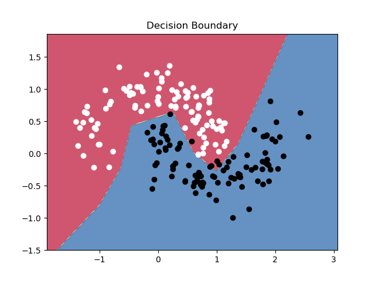

# Neural Network from Scratch (NumPy only)

A minimal deep learning framework implemented using only NumPy, trained on the classic `make_moons` nonlinear binary classification dataset.

## Features

- Fully modular design (layers, activations, losses)
- Custom training loop with forward/backpropagation
- Binary classification using sigmoid + binary cross-entropy
- Decision boundary and loss curve visualization

## Dataset

Using `make_moons` from `sklearn.datasets`:
- Two interleaving half circles
- Nonlinearly separable

## Plots

Epoch VS Loss plot

Decision Boundary

